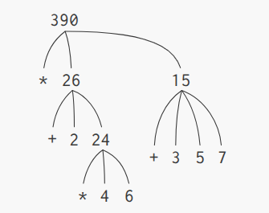

# 1.1.3. Thực thi biểu thức kết hợp

Một trong các mục tiêu trong chương này là làm rõ vấn đề về việc _tư duy quy trình_. Tại thời điểm này, khi chúng ta nghĩ về nó, khi **thực thi** _biểu thức kết hợp_, **trình phiên dịch** tự nó đã tuân theo một **quy trình**.

Để **thực thi** _biểu thức kết hợp_, nó làm theo các bước sau:

1. **Thực thi** các _biểu thức con_ của _biểu thức kết hợp_
2. Áp dụng quy trình mà nó chính là giá trị nằm bên trái ngoài cùng (chính là **phép biến đổi**) với **đối số** chính là các giá trị của các biểu thức con khác (các **phần tử**)[^1]

_Quy tắc_ này tuy đơn giản nhưng nó thể hiện một số tính chất chung quan trọng của **tiến trình**. Đầu tiên, ta thấy rằng bước 1 thể hiện rằng để hoàn thành việc **thực thi** một **tiến trình** của _biểu thức kết hợp_, chúng ta cần _trước tiên_ **thực thi** các **tiến trình** ở mỗi **phần tử** của _biểu thức kết hợp_ đó. Do vậy, _quy tắc_ thực thi là **đệ quy** theo tự nhiên; tức là, nó bao gồm việc trong từng bước, nó cần **thực thi** _quy tắc_ của nó.

Để ý rằng ý tưởng **đệ quy** có thể dùng để diễn giải xúc tích, trong trường hợp mà _biểu thức kết hợp_ lồng nhau rất sâu, cũng sẽ chỉ được coi là một **tiến trình** phức tạp hơn. Ví dụ, **thực thi**

```bash
(* (+ 2 (* 4 6)) (+ 3 5 7))
```

yêu cầu _quy tắc_ **thực thi** được áp dụng dụng cho 4 _biểu thức kết hợp_ khác nhau. Chúng ta có thể thấy được bức tranh của tiến trình này bằng cách biểu diễn _biểu thức kết hợp_ dưới dạng một cái cây, như ở hình dưới đây:



Tiếp theo, ta thấy việc áp dụng lặp lại của bước 1 khiến ta nhận ra rằng cái chúng ta cần **thực thi**, không phải là _biểu thức kết hợp_, mà _biểu thức nguồn_ như là số, _phép biến đổi có sẵn_, hoặc một số **tên** khác. Chúng ta đảm bảo xử lý cho các _trường hợp nguồn_ bằng cách:

- các giá trị của số chính là các số được viết
- các giá trị của các **phép biến đổi** là một chuỗi hướng dẫn máy để thực hiện **phép tính** đó, và
- các giá trị **tên** là các đối tượng có _liên kết_ với các **tên** đó trong **môi trường**

Chúng ta có thể coi quy tắc thứ 2 là một trường hợp đặc biệt của quy tắc thứ 3 bằng cách quy định các **ký hiệu** như `+` hay `\`, `*` cũng được chứa ở trong **môi trường toàn cục** và có _liên kết_ với chuỗi hướng dẫn máy rằng giá trị của dấu chính là giá trị của nó. Ý chính cần nắm ở đây là vai trò của **môi trường** trong việc xác định nghĩa của **ký hiệu** trong các **biểu thức**. Trong một ngôn ngữ có tính tương tác cao như Lisp, là vô nghĩa khi nói về giá trị của biểu thức như là `(+ x 1)` mà không nói rõ về **môi trường** mà cung cấp ý nghĩa cho **ký hiệu** `x` (hay thậm chí là **ký hiệu** `+`). Chúng ta sẽ thấy ở chương 3, ý tưởng chung của **môi trường**, là cung cấp ngữ cảnh mà việc **thực thi** diễn ra, sẽ đóng vai trò quan trọng để chúng ta hiểu được sự **thực thi** của **chương trình**.

Để ý là việc **thực thi** các _quy tắc_ ở trên không xử lý phần định nghĩa. Ví dụ, **thực thi** `(define x 3)` không áp dụng `define` với 2 **đối số** kia, một cái là giá trị mà **ký hiệu** `x` chứa và một cái là `3`, bởi vì mục đích của `define` là liên kết **ký hiệu** `x` với một giá trị. (nó là như vậy, `(define x 3)` không phải là _biểu thức kết hợp_)

Một số ngoại lệ của quy tắc thực thi chung được gọi là các _trường hợp đặc biệt_. `define` chỉ là 1 ví dụ trong số các các _trường hợp đặc biệt_, nhưng chúng ta sẽ thấy các cái cái khác sớm thôi. Mỗi _trường hợp đặc biệt_ lại có _quy tắc_ thực thi riêng Sự đa dạng của các biểu thức (mỗi cái lại gắn với một _quy tắc_) tạo ra cú pháp của ngôn ngữ lập trình. Khi so sánh với đa số ngôn ngữ lập trình khác, Lisp có cú pháp rất đơn giản; _quy tắc_ thực thi cho các biểu thức có thể được miêu tả bằng một _quy tắc_ chung với các _quy tắc_ đặc biệt cho số lượng nhỏ các _trường hợp đặc biệt_.[^2]

---

[^1]: Có vẻ kỳ lạ khi _quy tắc_ thực thi quy định ở bước 1 rằng ta cần thực thi cả phần tử trái ngoài cùng của _biểu thức kết hợp_, vì ở thời điểm này nó chỉ có thể là một **phép biến đổi** như `+` hay `*` — tức là một _quy trình nguồn_ thực hiện phép cộng hay nhân. Về sau chúng ta sẽ thấy rằng khả năng xử lý các _biểu thức kết hợp_ có **phép biến đổi** là biểu thức tổng hợp sẽ rất hữu ích.

[^2]: Những _trường hợp đặc biệt_ đơn thuần chỉ là cách viết tiện hơn cho những thứ có thể viết theo dạng đồng nhất hơn đôi khi được gọi là _cú pháp đường_ (_syntactic sugar_), theo cách nói của Peter Landin. So với người dùng các ngôn ngữ khác, lập trình viên Lisp nhìn chung ít quan tâm đến cú pháp hơn. Sự coi thường cú pháp này một phần xuất phát từ tính linh hoạt của Lisp — rất dễ để thay đổi cú pháp bề mặt — và một phần là vì nhiều cấu trúc cú pháp "tiện lợi" làm ngôn ngữ kém đồng nhất thường gây rắc rối hơn là giúp ích khi chương trình lớn và phức tạp. Theo lời Alan Perlis: "Cú pháp đường gây ung thư dấu chấm phẩy."

---

`combination` `operator` `argument` `operand` `recursive` `primitive expression` `name` `environment` `symbol` `global environment` `expression` `program` `special form`
