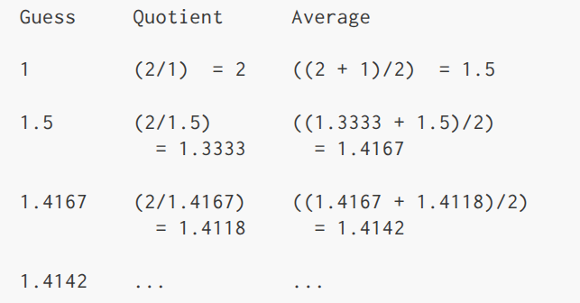

# 1.1.7 Ví dụ, căn bậc 2 bằng phương pháp Newton

Các quy trình, như đã giới thiệu ở trên, gần giống như các hàm toán học thông thường. Chúng chỉ ra một giá trị cụ thể với 1 hoặc nhiều tham số. Nhưng có một sự khác biệt lớn giữa các hàm toán học với các quy trình của máy tính. Quy trình của máy tính cần phải hiệu quả.

Ví dụ điển hình là tính toán căn bậc 2. chúng ta có thể định nghĩa hàm căn bậc 2 như thế này

$\sqrt{x}$ = với $y$ sao cho $y \ge 0$ và $y^2 = x$.

Cái này thể hiện hoàn hảo một hàm toán học. Chúng ta có thể dùng nó để nhận diện liệu một số có là căn bậc 2 của số khác, hoặc thể hiện tính chất của căn bậc 2 trong tổng quát. Trái lại, định nghĩa này không miêu tả một quy trình. Nó không hề nói gì về cách để tìm căn bậc 2 của một số cho trước. Kể cả khi ta diễn giải lại định nghĩa trên theo cách khác dùng mã giả lisp thì cũng không giải quyết được vấn đề:

```lisp
(define (sqrt x)
  (the y (and (>= y 0)
              (= (square y) x))))
```

Sự khác biệt giữa hàm và quy trình phản ánh sự khác nhau tổng quát giữa miêu tả tính chất của một thứ gì đó so với miêu tả làm sao để làm thứ đó, hoặc ta có thể nói đó là sự khác nhau giữa kiến thức khai báo với kiến thức ra lệnh. Trong toán học, chúng ta thường quan tâm đến các mô tả tính chất, trong khi trong khoa học máy tính chúng ta quan tâm với mô tả cách làm.[^1]

Làm sao để tính ra căn bậc 2? Cách phổ biến nhất là dùng phương pháp Newton về xấp xỉ liên tiếp, nó nói rằng bất kể khi chúng ta đoán y là giá trị căn bậc 2 của `x`, chúng ta có thể có thay đổi nhỏ để để đoán được tốt hơn bằng cách lấy trung bình `y` với `x/y`.[^2] Ví dụ, chúng ta có thể tính căn bậc 2 của `2` như sau, với giả định lần đoán đầu tiên là `1`:



Tiếp tục quá trình này, chúng ta càng tiến gần hơn đến giá trị xấp xỉ của căn bậc 2.

Bây giờ, chúng ta hãy thử diễn giải lại tiến trình theo ngôn ngữ của quy trình. Chúng ta bắt đầu với một giá trị và một giá trị để đoán. Nếu giá trị đoán đủ tốt chúng ta xong việc, nếu không thì chúng ta phải tiếp tục **tiến trình** với giá trị đoán tốt hơn, Chúng ta viết chiến thuật cơ bản này như một quy trình:

```lisp
(define (sqrt-iter guess x)
  (if (good-enough? guess x)
      guess
      (sqrt-iter (improve guess x) x)))
```

Kết quả đoán được cải thiện bằng cách tính trung bình nó với thương của số đó và giá trị đoán cũ:

```lisp
(define (improve guess x)
  (average guess (/ x guess)))
```

với

```lisp
(define (average x y)
  (/ (+ x y) 2))
```

Chúng ta cũng cần phải làm rõ rằng thế nào là đủ tốt. Cái tiếp theo sẽ miêu tả nó, nhưng nó thực sự không phải là cách kiểm tra tốt. Ý tưởng là cải thiện đáp án cho đến khi nó đủ gần hay nói cách khác là nằm trong sai số cho phép (ở đây là 0.001)[^3]

```lisp
(define (good-enough? guess x)
  (< (abs (- (square guess) x)) 0.001))
```

Cuối cùng, chúng ta cần tìm cách để bắt đầu. Ví dụ, chúng ta có thể luôn luôn đoán căn bậc 2 của bất kỳ số nào bắt đầu từ 1:

```lisp
(define (sqrt x)
  (sqrt-iter 1.0 x))
```

Nếu chúng ta nhập các định nghĩa này và trình phiên dịch, chúng ta có thể dùng `sqrt` như là dùng bất kỳ quy trình nào khác.[^4]

```lisp
(sqrt 9)
3.00009155413138

(sqrt (+ 100 37))
11.704699917758145

(sqrt (+ (sqrt 2) (sqrt 3)))
1.7739279023207892

(square (sqrt 1000))
1000.000369924366
```

Chương trình `sqrt` cũng thể hiện rằng ngôn ngữ quy trình đơn giản mà chúng ta đã được giải thích từ đầu đến giờ hiệu quả để biến bất kỳ chương trình số nào mà ta có thể viết ở C hay Pascal. Điều này nghe có vẻ bất ngờ, bởi chúng ta không hề có trong ngôn ngữ của chúng ta bất kỳ vòng lặp nào. `Sqrt-iter` ở khía cạnh khác, thể hiện rằng chúng ta có thể tạo vòng lặp bằng cách không dùng gì khác ngoài gọi một quy trình.[^5]

[^1]: Mô tả khai báo và mệnh lệnh có quan hệ mật thiết với nhau, cũng như toán học và khoa học máy tính vậy. Ví dụ, nói rằng kết quả của một chương trình là "đúng" chính là đưa ra một phát biểu khai báo về chương trình đó. Có rất nhiều nghiên cứu nhằm xây dựng kỹ thuật chứng minh tính đúng đắn của chương trình, và nhiều khó khăn kỹ thuật trong lĩnh vực đó liên quan đến việc chuyển đổi giữa các phát biểu mệnh lệnh (từ đó chương trình được xây dựng) và các phát biểu khai báo (có thể dùng để suy ra các tính chất). Một lĩnh vực quan trọng trong thiết kế ngôn ngữ lập trình là khám phá cái gọi là _ngôn ngữ cấp rất cao_, nơi người ta thực sự lập trình bằng các phát biểu khai báo. Ý tưởng là làm cho **trình phiên dịch** đủ tinh vi để, từ kiến thức "là gì" do lập trình viên cung cấp, nó có thể tự động tạo ra kiến thức "làm thế nào". Điều này không thể thực hiện trong trường hợp tổng quát, nhưng đã có những bước tiến quan trọng ở một số lĩnh vực. Chúng ta sẽ xem lại ý tưởng này ở chương 4.

[^2]: Thuật toán căn bậc 2 này thực ra là một trường hợp đặc biệt của phương pháp Newton, một kỹ thuật tổng quát để tìm nghiệm của phương trình. Bản thân thuật toán căn bậc 2 được phát triển bởi Heron của Alexandria vào thế kỷ I CN. Chúng ta sẽ thấy cách biểu diễn phương pháp Newton tổng quát như một **quy trình** Lisp ở mục 1.3.4.

[^3]: Theo quy ước, chúng ta thường đặt tên cho các _mệnh đề điều kiện_ kết thúc bằng dấu chấm hỏi, để giúp nhớ rằng chúng là _mệnh đề điều kiện_. Đây chỉ là quy ước viết code. Đối với **trình phiên dịch**, dấu chấm hỏi chỉ là một ký tự bình thường.

[^4]: Chú ý rằng chúng ta biểu diễn giá trị đoán ban đầu là `1.0` chứ không phải `1`. Điều này không tạo ra sự khác biệt trong nhiều cách triển khai Lisp. Tuy nhiên, MIT Scheme phân biệt giữa số nguyên chính xác và số thập phân, và phép chia hai số nguyên cho ra một phân số hữu tỉ chứ không phải số thập phân. Ví dụ, `10` chia `6` cho ra `5/3`, trong khi `10.0` chia `6.0` cho ra `1.6666666666666667`. (Chúng ta sẽ tìm hiểu cách cài đặt số học hữu tỉ ở mục 2.1.1.) Nếu bắt đầu với giá trị đoán `1` trong chương trình căn bậc 2, và `x` là số nguyên chính xác, thì tất cả các giá trị tiếp theo trong quá trình tính căn bậc 2 đều là số hữu tỉ. Vì các phép toán hỗn hợp giữa số hữu tỉ và số thập phân luôn cho ra số thập phân, nên việc bắt đầu với `1.0` đảm bảo tất cả các giá trị sau đều là số thập phân.

[^5]: Người đọc lo ngại về hiệu năng khi dùng lời gọi quy trình để hiện thực vòng lặp nên xem phần thảo luận về "đệ quy đuôi" ở mục 1.2.1.

---

[exercise 1.6](exercises/1.6.md) [exercise 1.7](exercises/1.7.md) [exercise 1.8](exercises/1.8.md) [`procedure`](GLOSSARY.md#procedure) [`predicate`](GLOSSARY.md#predicate) [`iterative process`](GLOSSARY.md#iterative-process) [`compound procedure`](GLOSSARY.md#compound-procedure)
