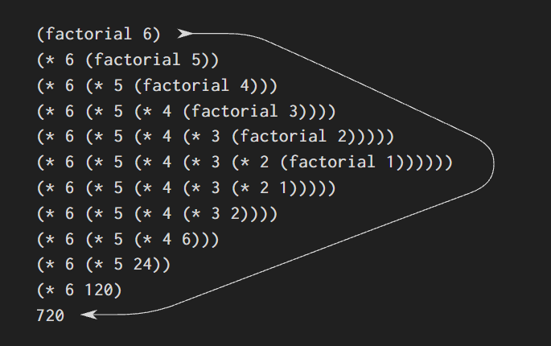
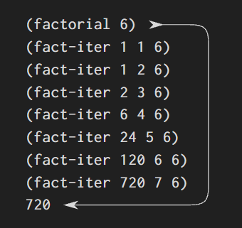

# 1.2.1 Đệ quy tuyến tính và lặp tuyến tính

Chúng ta bắt đầu bằng việc xem xét hàm giai thừa, được định nghĩa bởi

$$ n! = n \cdot (n - 1) \cdot (n - 2) \cdots 3 \cdot 2 \cdot 1. $$

Có rất nhiều cách để tính giai thừa. Một cách là để ý rằng $n!$ với bất kỳ số nguyên dương $n$ nào cũng bằng $n$ nhân với $(n - 1)!$:

$$ n! = n \cdot \left[ (n - 1) \cdot (n - 2) \cdots 3 \cdot 2 \cdot 1 \right] = n \cdot (n - 1)!. $$

Do đó chúng ta có thể tính $n!$ bằng cách tính $(n - 1)!$ rồi nhân kết quả với $n$. Nếu thêm vào quy ước rằng $1!$ bằng $1$, thì cách quan sát này được chuyển trực tiếp thành một quy trình:

```lisp
(define (factorial n)
  (if (= n 1)
      1
      (* n (factorial (- n 1)))))
```

Chúng ta có thể dùng mô hình thay thế đã học ở 1.1.5 để quan sát quy trình này hoạt động khi tính ra `6!`:



Bây giờ ta thử tiếp cận bài toán giai thừa theo một góc nhìn khác. Ta có thể mô tả một quy tắc tính `n!` bằng cách: trước hết nhân `1` với `2`, rồi nhân kết quả với `3`, rồi với `4`, và cứ thế cho đến khi đạt tới `n`. Cụ thể hơn, ta duy trì một tích đang chạy cùng với một bộ đếm chạy từ `1` đến `n`. Ta có thể mô tả tiến trình này bằng cách nói rằng ở mỗi bước, bộ đếm và tích đều thay đổi theo quy tắc:

```
tích       ← bộ đếm * tích
bộ đếm     ← bộ đếm + 1
```

và `n!` chính là giá trị của tích khi bộ đếm vượt qua `n`.

Một lần nữa ta có thể diễn giải lại cách tính này thành một quy trình để tính giai thừa:

```lisp
(define (factorial n)
  (fact-iter 1 1 n))

(define (fact-iter product counter max-count)
  (if (> counter max-count)
      product
      (fact-iter (* counter product)
                 (+ counter 1)
                 max-count)))
```

Cũng như trước, ta có thể dùng mô hình thay thế để quan sát tiến trình tính `6!`:[^2]



Hãy so sánh hai tiến trình trên. Nhìn từ một góc độ, chúng có vẻ chẳng khác nhau là mấy. Cả hai đều tính cùng một hàm toán học trên cùng một miền giá trị, và cả hai đều cần số bước tỉ lệ với `n` để tính ra `n!`. Thật vậy, cả hai tiến trình thậm chí còn thực hiện đúng cùng dãy phép nhân, tạo ra cùng dãy tích trung gian. Nhưng nếu để ý kỹ "hình thù" của hai tiến trình, ta sẽ thấy chúng phát triển rất khác nhau.

Hãy xét tiến trình thứ nhất. Mô hình thay thế cho thấy một hình thù phình ra rồi co lại (xem dãy biến đổi của `(factorial 6)` ở trên). Phần phình ra là do tiến trình tích lũy một chuỗi các **phép toán bị trì hoãn** (ở đây là một chuỗi các phép nhân). Sự co lại xảy ra khi các phép toán này thực sự được thực hiện. Loại tiến trình này, được đặc trưng bởi một chuỗi các phép toán bị trì hoãn, được gọi là _tiến trình đệ quy_. Để thực thi tiến trình này, trình phiên dịch phải lưu lại các phép toán còn cần phải làm sau đó. Khi tính `n!`, độ dài của chuỗi phép nhân bị trì hoãn, và do đó cả lượng thông tin cần lưu để theo dõi chúng, tăng tuyến tính theo `n` (tỉ lệ với `n`), hệt như số bước tính. Một tiến trình như thế gọi là **tiến trình đệ quy tuyến tính**.

Trái lại, tiến trình thứ hai không phình ra rồi co lại. Ở mỗi bước, tất cả những gì ta cần lưu lại với bất kỳ giá trị `n` nào chỉ là các giá trị hiện tại của các biến `product`, `counter`, và `max-count`. Ta gọi đây là một **tiến trình lặp tuyến tính**. Tổng quát, một _tiến trình lặp_ là một tiến trình mà trạng thái của nó có thể được tóm gọn bởi một số lượng cố định các **biến trạng thái**, kèm theo một quy tắc cố định mô tả cách các biến trạng thái cập nhật khi tiến trình chuyển từ trạng thái này sang trạng thái khác, và (tùy chọn) một bài kiểm tra kết thúc để xác định khi nào tiến trình nên dừng lại. Khi tính `n!`, số bước cần thiết tăng tuyến tính theo `n`. Một tiến trình như thế gọi là **tiến trình lặp tuyến tính**.

Ta cũng có thể nhìn nhận sự tương phản giữa hai tiến trình theo một cách khác. Trong tiến trình lặp, các biến trạng thái mô tả một cách trọn vẹn trạng thái của tiến trình tại mỗi điểm. Nếu ta dừng việc tính toán giữa chừng, để tiếp tục lại sau đó ta chỉ cần cung cấp giá trị của ba biến trạng thái cho trình phiên dịch. Với tiến trình đệ quy thì không như vậy. Ở đây còn có thêm một số thông tin "ẩn", do trình phiên dịch nắm giữ chứ không nằm trong các biến của chương trình, cho biết tiến trình đang ở đâu trong việc xử lý chuỗi các phép toán bị trì hoãn. Chuỗi này càng dài thì càng có nhiều thông tin cần phải lưu giữ.[^3]

Khi so sánh giữa lặp và đệ quy, chúng ta phải cẩn thận để không nhầm lẫn khái niệm **tiến trình đệ quy** với khái niệm **quy trình đệ quy**. Khi ta nói một quy trình là đệ quy, ta đang nói về một sự thật về cú pháp rằng định nghĩa của quy trình có tham chiếu (trực tiếp hoặc gián tiếp) đến chính nó. Còn khi ta nói một tiến trình tuân theo một hình thù nào đó, ví dụ đệ quy tuyến tính, ta đang nói về cách tiến trình tiến triển, chứ không phải về cú pháp dùng để viết ra một quy trình. Có thể nghe hơi lạ tai khi ta nói rằng một quy trình đệ quy như `fact-iter` lại tạo ra một tiến trình lặp. Nhưng tiến trình ở đây thực sự là lặp: trạng thái của nó được nắm bắt trọn vẹn bởi ba biến trạng thái, và trình phiên dịch chỉ cần theo dõi đúng ba biến đó để thực thi tiến trình.

Một lý do khiến sự phân biệt giữa tiến trình và quy trình hay gây bối rối là vì hầu hết các cách triển khai của các ngôn ngữ phổ biến (gồm Ada, Pascal và C) được thiết kế sao cho việc phiên dịch bất kỳ quy trình đệ quy nào cũng tiêu tốn một lượng bộ nhớ tăng theo số lần gọi quy trình, ngay cả khi tiến trình được mô tả về bản chất là lặp. Hệ quả là, các ngôn ngữ này chỉ có thể mô tả các tiến trình lặp bằng cách dùng đến các "cấu trúc lặp" chuyên dụng như `do`, `repeat`, `until`, `for`, và `while`. Cách triển khai của Scheme mà ta sẽ xem xét trong chương 5 không có khuyết điểm này. Nó sẽ thực thi một tiến trình lặp trong một lượng bộ nhớ không đổi, kể cả khi tiến trình lặp được mô tả bằng một quy trình đệ quy. Một cách triển khai có tính chất này được gọi là **đệ quy đuôi**. Với một cách triển khai đệ quy đuôi, ta có thể mô tả việc lặp bằng chính cơ chế gọi quy trình thông thường, đến mức các cấu trúc lặp chuyên dụng chỉ còn hữu dụng như một dạng viết tắt cho dễ đọc.[^1]

[^1]: Đệ quy đuôi từ lâu đã được biết đến như một mẹo biên dịch. Một nền tảng nhất quán cho đệ quy đuôi dường như đã được Carl Hewitt cung cấp lần đầu (1977), người đã giải thích nó dựa trên mô hình tính toán "truyền thông điệp" (message-passing) mà ta sẽ nghiên cứu trong chương 3. Lấy cảm hứng từ đó, Gerald Jay Sussman và Guy Lewis Steele Jr. (xem Steele 1975) đã xây dựng một trình phiên dịch Scheme đệ quy đuôi. Sau này Steele chỉ ra rằng đệ quy đuôi là hệ quả của một cách biên dịch tự nhiên cho lời gọi quy trình (Steele 1977). Chuẩn IEEE cho Scheme yêu cầu mọi cách triển khai Scheme đều phải là đệ quy đuôi.

[^2]: Trong một chương trình thực tế, chúng ta có thể dùng _cấu trúc khối_ được giới thiệu ở mục trước để ẩn đi định nghĩa của `fact-iter`:

```lisp
(define (factorial n)
  (define (iter product counter)
    (if (> counter n)
        product
        (iter (* counter product)
              (+ counter 1))))
  (iter 1 1))
```

[^3]: Khi thảo luận về cách hiện thực các quy trình trên các _máy thanh ghi_ ở chương 5, chúng ta sẽ thấy rằng bất kỳ _tiến trình lặp_ nào cũng có thể được hiện thực "trên phần cứng" như một máy có một tập thanh ghi cố định và không cần bộ nhớ bổ sung. Ngược lại, để hiện thực một _tiến trình đệ quy_, cần có một cấu trúc dữ liệu bổ sung gọi là _ngăn xếp_ (stack).

---

`process` `procedure` `tail recursion` `recursive process` `iterative process` `linear recursive process` `linear iterative process` `deferred operations` `state variables`
