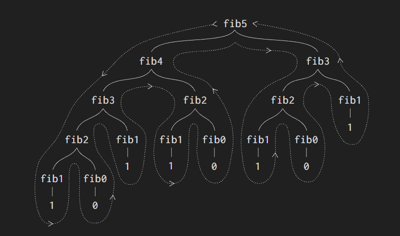

# 1.2.2 Đệ quy cây

Một hình thù tính toán phổ biến khác là **đệ quy cây**. Để làm ví dụ, hãy xét việc tính dãy **số Fibonacci**, trong đó mỗi số bằng tổng của hai số đứng ngay trước nó:

$$ 0,\ 1,\ 1,\ 2,\ 3,\ 5,\ 8,\ 13,\ 21,\ \ldots $$

Nói chung, các **số Fibonacci** có thể được định nghĩa bằng _quy tắc_:

$$
\mathrm{Fib}(n) =
\begin{cases}
0 & \text{nếu } n = 0, \\
1 & \text{nếu } n = 1, \\
\mathrm{Fib}(n-1) + \mathrm{Fib}(n-2) & \text{trong các trường hợp khác.}
\end{cases}
$$

Ta có thể chuyển ngay định nghĩa này thành một **quy trình** **đệ quy** để tính các **số Fibonacci**:

```lisp
(define (fib n)
  (cond ((= n 0) 0)
        ((= n 1) 1)
        (else (+ (fib (- n 1))
                 (fib (- n 2))))))
```

Hãy quan sát hình thù của phép tính này. Để tính `(fib 5)`, ta cần tính `(fib 4)` và `(fib 3)`. Để tính `(fib 4)`, ta lại cần tính `(fib 3)` và `(fib 2)`. Cứ như vậy, **tiến trình** được sinh ra trông giống như một cái cây, như minh họa ở Hình 1.5. Để ý rằng các nhánh tách đôi tại mỗi tầng (trừ phần dưới cùng); điều này phản ánh việc quy trình `fib` gọi lại chính nó hai lần mỗi khi được gọi.



Quy trình này đáng học hỏi vì nó là một ví dụ điển hình của **đệ quy cây**, nhưng nó lại là một cách tệ để tính các **số Fibonacci**, bởi nó lặp lại quá nhiều phép tính thừa thãi. Hãy để ý trong Hình 1.5 rằng toàn bộ việc tính `(fib 3)` — gần như một nửa khối lượng công việc — bị làm lại hai lần. Thực ra, không khó để chứng minh rằng số lần quy trình tính `(fib 1)` hoặc `(fib 0)` (tức số lá của cái cây nói trên, tính trong trường hợp tổng quát) chính xác bằng $\mathrm{Fib}(n+1)$. Để hình dung mức độ tệ hại của điều này, ta có thể chứng minh được rằng giá trị $\mathrm{Fib}(n)$ tăng **theo cấp lũy thừa** của `n`. Chính xác hơn (xem Bài tập 1.13), $\mathrm{Fib}(n)$ là số nguyên gần nhất với $\varphi^n / \sqrt{5}$, trong đó

$$ \varphi = \frac{1 + \sqrt{5}}{2} \approx 1{,}6180 $$

là **tỉ lệ vàng**, thỏa mãn phương trình

$$ \varphi^2 = \varphi + 1. $$

Như vậy, tiến trình này dùng một số bước tăng **theo cấp lũy thừa** của đầu vào. Trong khi đó, không gian (bộ nhớ) cần dùng chỉ tăng tuyến tính theo đầu vào, vì tại mỗi thời điểm ta chỉ cần lưu lại những nút nằm phía trên ta trên cây. Tổng quát, số bước mà một **tiến trình đệ quy cây** cần dùng tỉ lệ với số nút trong cây, còn không gian cần dùng tỉ lệ với độ sâu lớn nhất của cây.

Ta cũng có thể xây dựng một _tiến trình lặp_ để tính các **số Fibonacci**. Ý tưởng là dùng một cặp số nguyên `a` và `b`, khởi tạo lần lượt bằng $\mathrm{Fib}(1) = 1$ và $\mathrm{Fib}(0) = 0$, rồi liên tục áp dụng đồng thời hai phép biến đổi:

```
a ← a + b
b ← a
```

Không khó để chứng minh rằng sau khi áp dụng phép biến đổi này `n` lần, `a` và `b` sẽ lần lượt bằng $\mathrm{Fib}(n+1)$ và $\mathrm{Fib}(n)$. Vậy ta có thể tính các **số Fibonacci** theo kiểu lặp bằng quy trình:

```lisp
(define (fib n)
  (fib-iter 1 0 n))

(define (fib-iter a b count)
  (if (= count 0)
      b
      (fib-iter (+ a b) a (- count 1))))
```

Cách thứ hai để tính $\mathrm{Fib}(n)$ này là một phép lặp tuyến tính. Sự chênh lệch về số bước giữa hai cách — một bên tuyến tính theo `n`, một bên tăng nhanh ngang với chính $\mathrm{Fib}(n)$ — là vô cùng lớn, ngay cả với những đầu vào nhỏ.

Tuy nhiên, ta không nên vội kết luận rằng các **tiến trình đệ quy cây** là vô dụng. Khi xét đến những tiến trình làm việc trên dữ liệu có cấu trúc phân cấp thay vì trên các con số, ta sẽ thấy **đệ quy cây** là một công cụ tự nhiên và mạnh mẽ. Mà ngay cả với các phép tính trên số, các **tiến trình đệ quy cây** cũng có thể hữu ích trong việc giúp ta hiểu và thiết kế chương trình.[^1] Chẳng hạn, dù quy trình `fib` đầu tiên kém hiệu quả hơn nhiều so với quy trình thứ hai, nó lại đơn giản và dễ hiểu hơn, gần như chỉ là một bản dịch trực tiếp định nghĩa của dãy Fibonacci sang Lisp. Còn để viết được thuật toán lặp, ta phải nhận ra rằng phép tính có thể được tổ chức lại thành một phép lặp với ba **biến trạng thái**.

## Ví dụ: đếm số cách đổi tiền

Để nghĩ ra thuật toán lặp tính số Fibonacci thì chỉ cần một chút khéo léo. Ngược lại, hãy xét bài toán sau: có bao nhiêu cách khác nhau để đổi một đồng `1.00` đô la, biết rằng ta có các loại xu nửa đô, một phần tư đô, một hào, năm xu và một xu? Tổng quát hơn, liệu ta có thể viết một quy trình để tính số cách đổi một khoản tiền bất kỳ hay không?

Bài toán này có một lời giải đơn giản dưới dạng một quy trình **đệ quy**. Giả sử ta hình dung các loại xu hiện có được sắp xếp theo một thứ tự nào đó. Khi đó ta có hệ thức sau:

Số cách đổi một khoản tiền `a` bằng `n` loại xu bằng:

- số cách đổi khoản tiền `a` mà **không** dùng đến loại xu đầu tiên, cộng với
- số cách đổi khoản tiền `a − d` bằng cả `n` loại xu, trong đó `d` là **mệnh giá** của loại xu đầu tiên.

Để thấy vì sao điều này đúng, hãy để ý rằng các cách đổi tiền có thể được chia thành hai nhóm: nhóm không dùng đồng xu nào thuộc loại đầu tiên, và nhóm có dùng. Vậy nên tổng số cách đổi một khoản tiền nào đó bằng tổng của: số cách đổi khoản tiền đó mà không dùng đến loại xu đầu tiên, cộng với số cách đổi có dùng đến loại xu đầu tiên. Mà con số sau lại đúng bằng số cách đổi phần tiền còn lại sau khi đã dùng một đồng xu thuộc loại đầu tiên.

Như vậy, ta có thể quy bài toán đổi một khoản tiền cho trước về các bài toán đổi những khoản tiền nhỏ hơn bằng số loại xu ít hơn. Hãy ngẫm kỹ _quy tắc_ rút gọn này và tự thuyết phục bản thân rằng ta có thể dùng nó để mô tả một thuật toán, miễn là ta chỉ rõ thêm các **trường hợp suy biến** sau:[^2]

- Nếu `a` đúng bằng `0`, ta tính đó là `1` cách đổi tiền.
- Nếu `a` nhỏ hơn `0`, ta tính đó là `0` cách đổi tiền.
- Nếu `n` bằng `0`, ta tính đó là `0` cách đổi tiền.

Ta có thể dễ dàng chuyển mô tả này thành một quy trình **đệ quy**:

```lisp
(define (count-change amount)
  (cc amount 5))

(define (cc amount kinds-of-coins)
  (cond ((= amount 0) 1)
        ((or (< amount 0)
             (= kinds-of-coins 0))
         0)
        (else
         (+ (cc amount (- kinds-of-coins 1))
            (cc (- amount (first-denomination
                           kinds-of-coins))
                kinds-of-coins)))))

(define (first-denomination kinds-of-coins)
  (cond ((= kinds-of-coins 1) 1)
        ((= kinds-of-coins 2) 5)
        ((= kinds-of-coins 3) 10)
        ((= kinds-of-coins 4) 25)
        ((= kinds-of-coins 5) 50)))
```

(Quy trình `first-denomination` nhận vào số loại xu hiện có và trả về **mệnh giá** của loại xu đầu tiên. Ở đây ta hình dung các đồng xu được sắp từ lớn đến nhỏ, nhưng thứ tự nào cũng cho kết quả như nhau.) Giờ ta có thể trả lời câu hỏi ban đầu về việc đổi một đồng đô la:

```lisp
(count-change 100)
292
```

Quy trình `count-change` sinh ra một **tiến trình đệ quy cây** với những phần tính toán thừa lặp lại giống như ở lần triển khai `fib` đầu tiên của ta. (Sẽ phải mất kha khá thời gian thì con số `292` đó mới được tính ra.) Mặt khác, cũng không dễ thấy ngay làm thế nào để thiết kế một thuật toán tốt hơn để tính ra kết quả, và ta sẽ để vấn đề này lại như một thử thách. Việc một **tiến trình đệ quy cây** có thể rất kém hiệu quả nhưng lại thường dễ mô tả và dễ hiểu đã khiến người ta đề xuất rằng ta có thể đạt được cái hay của cả hai phía bằng cách thiết kế một "trình biên dịch thông minh", một trình có khả năng biến đổi các quy trình đệ quy cây thành các quy trình hiệu quả hơn mà vẫn cho ra cùng kết quả.[^3]

[^1]: Một ví dụ về điều này đã được gợi ý ở phần 1.1.3: bản thân trình phiên dịch cũng thực thi các biểu thức bằng một tiến trình đệ quy cây.

[^2]: Ví dụ, hãy thử lần theo thật chi tiết xem _quy tắc_ rút gọn áp dụng ra sao cho bài toán đổi `10` xu bằng các đồng một xu và năm xu.

[^3]: Một cách để đối phó với những phép tính thừa là sắp xếp sao cho ta tự động dựng nên một bảng các giá trị ngay khi chúng được tính ra. Mỗi lần được yêu cầu áp dụng quy trình lên một đối số nào đó, trước tiên ta tra xem giá trị đã có sẵn trong bảng hay chưa; nếu có thì ta tránh được việc tính lại thừa thãi. Chiến lược này, gọi là _lập bảng_ (tabulation) hay _ghi nhớ_ (memoization), có thể được triển khai một cách khá đơn giản. Lập bảng đôi khi có thể biến những tiến trình cần một số bước theo cấp lũy thừa (như `count-change`) thành những tiến trình có nhu cầu về không gian và thời gian chỉ tăng tuyến tính theo đầu vào. Xem Bài tập 3.27.

---

[`tree recursion`](GLOSSARY.md#tree-recursion) [`Fibonacci numbers`](GLOSSARY.md#fibonacci-numbers) [`procedure`](GLOSSARY.md#procedure) [`golden ratio`](GLOSSARY.md#golden-ratio) [`tree-recursive process`](GLOSSARY.md#tree-recursive-process) [`iterative process`](GLOSSARY.md#iterative-process) [`state variables`](GLOSSARY.md#state-variables) [`denomination`](GLOSSARY.md#denomination)
